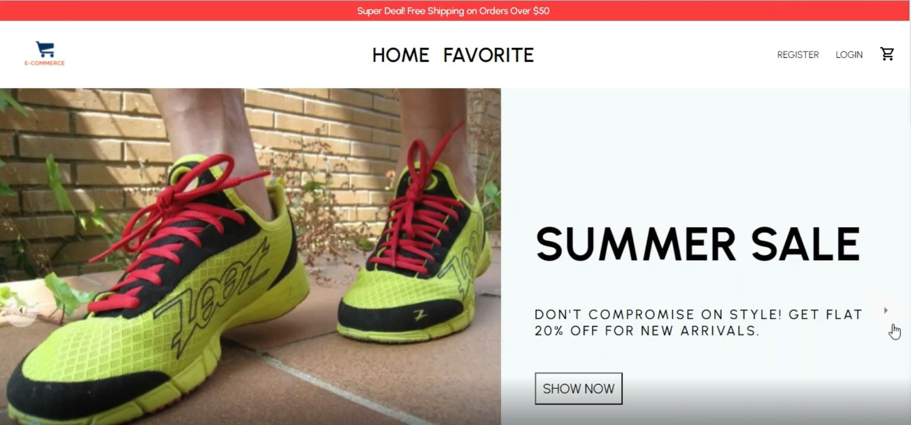
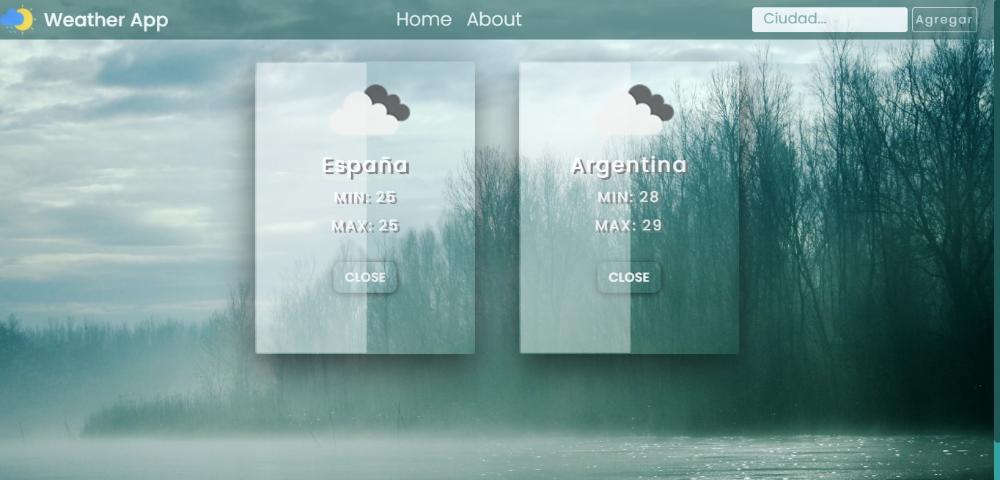
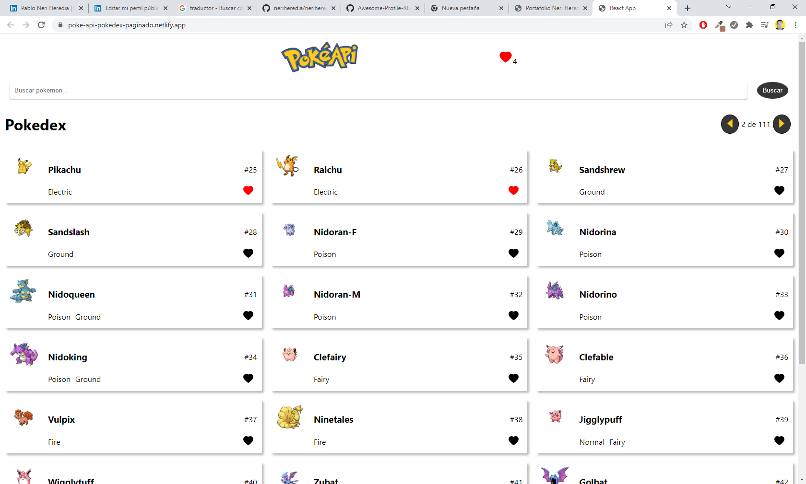
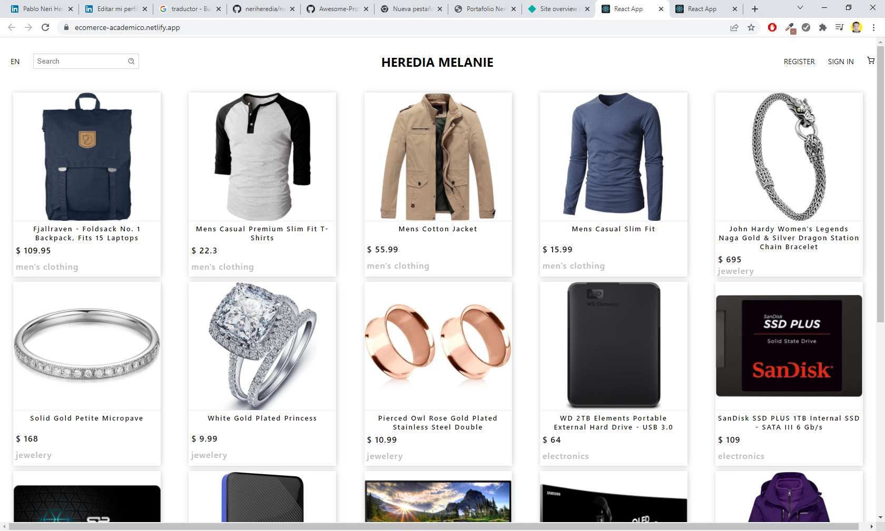
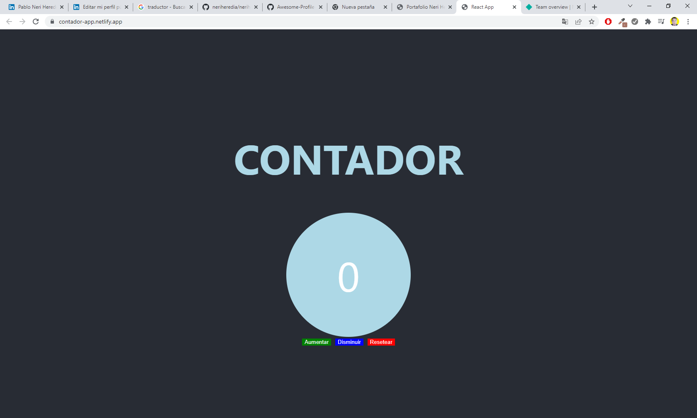
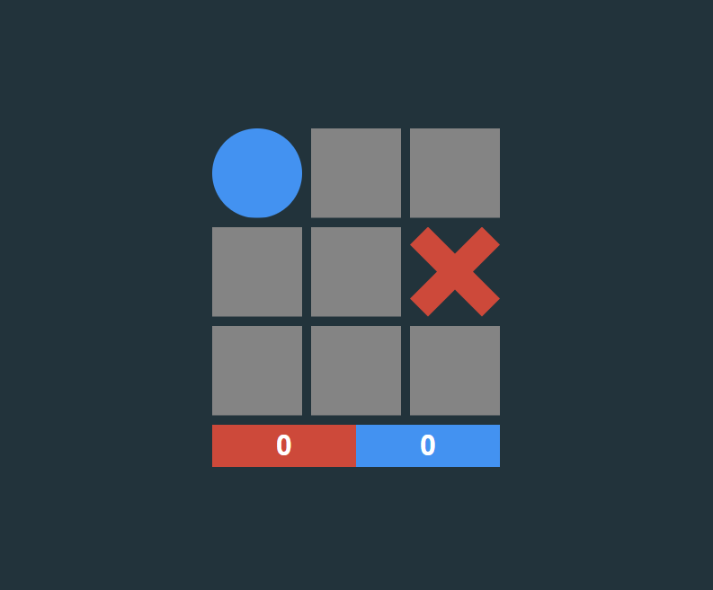

[](https://portafolio-neriheredia.netlify.app/)

<h2><strong>🤓 ABOUT ME</strong></h2>
<p><strong>I am a Full-Stack Developer</strong>, with experience in Web and Mobile Application Development, both Front-End and Back-End. Every day I keep looking for challenges, challenges, so I can improve professionally.
I consider myself a decisive, collaborative, creative and passionate person for programming.

One of my greatest motivations is to learn and help. Always studying and updating myself on everything new and helping those people who are just starting out in this beautiful world of programming.</p>
  
```javascript
const myStack = {
  code: ["Javascript", "HTML", "CSS"],
  technologies: [
    {
      frontEnd: {
        javascript: ["React", "Redux", "Redux/Toolkit", "Persist","React Native", "GraphQL", "CubeJs"],
        css: ["Styled Components", "CSS Modules", "SASS", "Bootstrap"],
      },
    },
    {
      backEnd: {
        javascript: ["NodeJS", "Express", "Sequelize", "Mongoose","Apollo Server"],
      },
      databases: ["PostgreSQL", "MongoDB", "MySQL", "Firebase"],
    },
    {
      Others: {
        authentication: ["Json Web TOken"],
        prototyping: ["Figma"],
        library: ["Material UI"],
      },
    },
  ],
  currentStatus: ["✨Looking for a Job✨"],
  locationPreferences: ["✨Fully Remote✨"],
};
```

### 💡 A passionate Full Stack Developer from Argentina

- 🔭 I’m currently working on **Henry Bootcamp**

- 🧑🏻‍💻 All of my projects are available at [https://portafolio-neriheredia.netlify.app/](https://portafolio-neriheredia.netlify.app/)

- 📝 Connect with me by Linkedin [www.linkedin.com/in/neriheredia](www.linkedin.com/in/neriheredia/)

- 📫 How to reach me **developer.heredia@gmail.com**

### 📊 My GitHub's Stats


### Languages and Tools

<!-- <h3 align="left">Languages and Tools:</h3> -->
<p align="left"> <a href="https://getbootstrap.com" target="_blank" rel="noreferrer">  </a> <a href="https://www.w3schools.com/css/" target="_blank" rel="noreferrer">  </a> <a href="https://expressjs.com" target="_blank" rel="noreferrer">  </a> <a href="https://www.figma.com/" target="_blank" rel="noreferrer">  </a> <a href="https://firebase.google.com/" target="_blank" rel="noreferrer">  </a> <a href="https://git-scm.com/" target="_blank" rel="noreferrer">  </a> <a href="https://heroku.com" target="_blank" rel="noreferrer">  </a> <a href="https://www.w3.org/html/" target="_blank" rel="noreferrer">  </a> <a href="https://developer.mozilla.org/en-US/docs/Web/JavaScript" target="_blank" rel="noreferrer">  </a> <a href="https://materializecss.com/" target="_blank" rel="noreferrer">  </a> <a href="https://www.mongodb.com/" target="_blank" rel="noreferrer">  </a> <a href="https://www.microsoft.com/en-us/sql-server" target="_blank" rel="noreferrer">  </a> <a href="https://www.mysql.com/" target="_blank" rel="noreferrer">  </a> <a href="https://nodejs.org" target="_blank" rel="noreferrer">  </a> <a href="https://www.postgresql.org" target="_blank" rel="noreferrer">  </a> <a href="https://postman.com" target="_blank" rel="noreferrer">  </a> <a href="https://reactjs.org/" target="_blank" rel="noreferrer">  </a> <a href="https://redux.js.org" target="_blank" rel="noreferrer">  </a> <a href="https://sass-lang.com" target="_blank" rel="noreferrer">  </a> </p>

### My proyects

<p>
  <a href="https://portafolio-neriheredia.netlify.app/" target="_blank" rel="noreferrer" 
    style='padding-right:15px;'>
    
  </a>
  <a href='https://client-videogames-neri.herokuapp.com/' target="_blank" rel="noreferrer">
    
  </a>
</p>

<p>
  <a href='https://clima-app-react-henry.netlify.app/' target="_blank" rel="noreferrer">
    
  </a>
  <a href='https://poke-api-pokedex-paginado.netlify.app/' target="_blank" rel="noreferrer">
    
  </a>
  <a href='https://ecomerce-academico.netlify.app/' target="_blank" rel="noreferrer">
    
  </a>
</p>
<p>
  <a href='https://contador-app.netlify.app/' target="_blank" rel="noreferrer">
    
  </a>
  <a href='https://affectionate-torvalds-7bfa9a.netlify.app/' target="_blank" rel="noreferrer">
    
  </a>
</p>
&nbsp;

- 🔭 I’m currently working on a <strong>Training App Fullstack Project...</strong>
- 🔭 I’m currently working on a <strong>Events App Fullstack Project...</strong>
- 🌱 I’m currently learning <strong>React Native</strong> for the Mobile FrontEnd...


